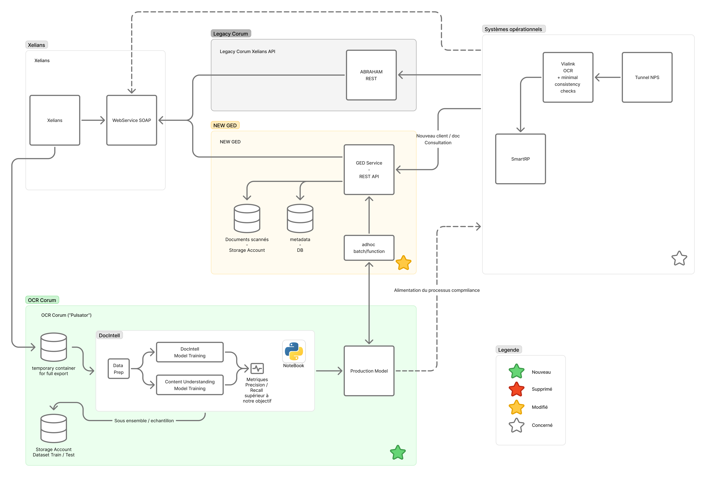
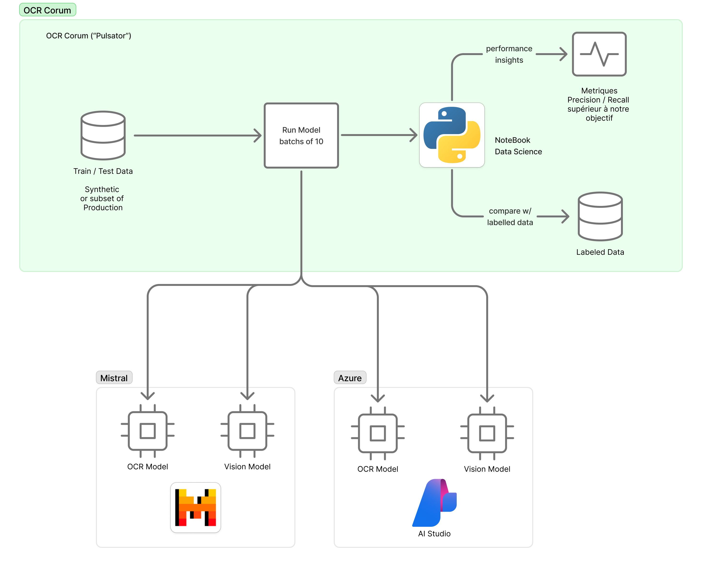
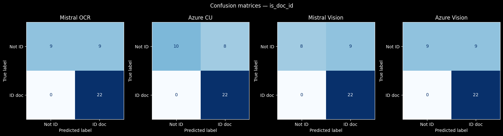

# Docs Analyser

Batch analysis of identity documents (ID cards, passports) using four independent AI backends — Mistral OCR, Mistral Vision (Pixtral), Azure Content Understanding, and Azure OpenAI Vision — with result comparison.


## Solution Proposée

Overview synaptique de la solution, intégrée avec les applications et les services existants (GED, Systèmes legacy, opérationnels, ...)




Overview de la solution, l'application 'data science' créée dans ce repo.




## Résultats de l'analyse & performances des modèles



## Conclusion — Performance des modèles sur `is_doc_id`

L'analyse porte sur **43 fichiers** labellisés (22 documents d'identité, 21 non-identité). Azure CU couvre l'ensemble du dataset (n=43) ; Mistral OCR et Azure Vision en couvrent 40, Mistral Vision 39 (prédictions manquantes sur certains fichiers).

### Résultats

| Modèle | n | Accuracy | Precision | Recall | F1 | MCC | TP | TN | FP | FN |
|---|---|---|---|---|---|---|---|---|---|---|
| **Azure CU** | **43** | **0.84** | **0.76** | **1.00** | **0.86** | **0.71** | 22 | 14 | 7 | 0 |
| Mistral OCR | 40 | 0.78 | 0.71 | 1.00 | 0.83 | 0.60 | 22 | 9 | 9 | 0 |
| Azure Vision | 40 | 0.78 | 0.71 | 1.00 | 0.83 | 0.60 | 22 | 9 | 9 | 0 |
| Mistral Vision | 39 | 0.77 | 0.71 | 1.00 | 0.83 | 0.58 | 22 | 8 | 9 | 0 |

### Points clés

**Recall parfait (1.00) sur les quatre modèles** — aucun document d'identité réel n'est manqué. C'est la propriété la plus critique en vérification documentaire : un faux négatif représente un risque métier majeur.

**Azure CU est nettement le meilleur modèle** (F1 = 0.86, MCC = 0.71, 7 FP sur 43 fichiers), avec un avantage clair sur les trois autres modèles (F1 = 0.83, MCC = 0.58–0.60, 9 FP). Azure CU est aussi le seul à avoir analysé la totalité du dataset sans prédictions manquantes.

**Tous les faux positifs proviennent des dossiers `false_id` et `false_doc`** — images de documents d'identité trouvées sur Internet, ou documents administratifs visuellement proches. Les modèles réagissent à l'apparence visuelle du document, pas à son authenticité. C'est un biais structurel du jeu de données. Les 7 FP d'Azure CU sont tous dans `false_id` ; Mistral OCR étend ses erreurs à un fichier `false_doc` supplémentaire.

**MCC entre 0.58 et 0.71** — Azure CU atteint un niveau correct (0.71) tandis que les autres modèles restent en deçà du seuil recommandé pour la production (> 0.80). L'approche OCR structurée d'Azure CU apporte ici un gain mesurable par rapport à la vision pure.

### Recommandations

1. **Azure CU à privilégier** : meilleur MCC (0.71 vs 0.60), moins de faux positifs (7 vs 9), couverture complète du dataset.
2. **Étendre le dataset** avec des cas négatifs réels (factures, relevés bancaires) pour confirmer la robustesse — les faux positifs actuels sont tous des images de documents d'identité.
3. **Exploiter `id_doc_type`** comme filtre secondaire (passeport vs carte d'identité) pour affiner la décision au-delà du booléen.

## Métriques d'évaluation — rappel

| Métrique | Formule | Ce qu'elle mesure | Plage | Objectif | Quand l'utiliser |
|---|---|---|---|---|---|
| **Accuracy** | (TP + TN) / Total | Part des prédictions correctes (toutes classes) | [0, 1] | → 1 | Classes équilibrées |
| **Precision** | TP / (TP + FP) | Parmi les positifs prédits, combien sont vrais | [0, 1] | → 1 | Coût élevé des faux positifs |
| **Recall** | TP / (TP + FN) | Parmi les vrais positifs, combien sont détectés | [0, 1] | → 1 | Coût élevé des faux négatifs |
| **F1** | 2 × (P × R) / (P + R) | Moyenne harmonique Precision/Recall | [0, 1] | → 1 | Classes déséquilibrées |
| **MCC** | (TP·TN − FP·FN) / √(...) | Corrélation entre prédictions et réalité | [−1, 1] | → 1 | Déséquilibre sévère, vision globale |

> **Légende :** TP = vrai positif · TN = vrai négatif · FP = faux positif · FN = faux négatif
> **Valeurs de référence MCC :** −1 = prédictions systématiquement inverses · 0 = aléatoire · +1 = parfait

### Règles d'or
- **Accuracy** trompe sur des classes déséquilibrées (ex : 95% de classe majoritaire).
- **Precision vs Recall** : arbitrage selon le coût métier de chaque type d'erreur.
- **F1** synthétise les deux, mais suppose que Precision et Recall ont le même poids.
- **MCC** est le seul indicateur symétrique sur toutes les cases de la matrice de confusion — privilégié en contexte médical, fraud detection, KYC/AML.

## Setup

Requires Python 3.12 and [uv](https://docs.astral.sh/uv/).

```bash
uv sync
```

Create a `.env` file at the project root:

```
MISTRAL_API_KEY=your_mistral_key

CONTENTUNDERSTANDING_ENDPOINT=https://your-resource.services.ai.azure.com/
CONTENTUNDERSTANDING_KEY=your_azure_key

AZURE_OPENAI_ENDPOINT=https://your-resource.openai.azure.com/
AZURE_OPENAI_KEY=your_azure_openai_key

# Optional — disable one provider entirely (default: both enabled)
MISTRAL_ENABLED=true
AZURE_ENABLED=true

# Optional — Azure Blob Storage dataset source (see "Dataset source" below)
BLOB_SAS_URL=https://<account>.blob.core.windows.net/<container>?<sas-token>
```

### Azure prerequisites

Both Azure analysers require models deployed in your Azure AI Foundry resource:

- `gpt-4.1` — field extraction (Content Understanding) and vision classification (Azure OpenAI)
- `text-embedding-3-large` — semantic document chunking (Content Understanding only)

## Usage

```bash
uv run main.py                          # all analysers, local dataset/
MISTRAL_ENABLED=false uv run main.py    # Azure only (no Mistral API key needed)
AZURE_ENABLED=false uv run main.py      # Mistral only (no Azure keys needed)
uv run pytest tests/                    # run unit tests
uv run pytest tests/test_dataset.py -v  # run integration tests against real APIs
```

The output `results.csv` is written to the project root.

### Dataset source

The runner supports two mutually exclusive sources, selected via the `BLOB_SAS_URL` environment variable.

**Local directory (default)**

Place images (`.jpg`, `.jpeg`, `.png`) and PDFs in `dataset/` before running:

```
dataset/
├── id_cards/
├── passports/
├── jdd/
├── false_id/
└── false_doc/
```

**Azure Blob Storage**

Set `BLOB_SAS_URL` to a container-level SAS URL. Files are **not downloaded** — their SAS URLs are passed directly to each AI API, which fetches the content itself.

```bash
BLOB_SAS_URL="https://<account>.blob.core.windows.net/<container>?sv=..." uv run main.py
```

The container is expected to mirror the local folder structure (blobs named `id_cards/<filename>`, etc.). The `file_path` column in `results.csv` is derived from the blob's virtual folder prefix.

> **Required SAS permissions:** the token must grant **Read** (`r`) and **List** (`l`) on the container. A read-only blob SAS is not sufficient — listing requires a container-scoped SAS with at minimum `rl` permissions.
>
> In the Azure Portal: *Storage account → Shared access signature → Allowed permissions → check Read + List → Resource type = Container + Object*.

## Architecture

```
docs_analyser/
├── base.py                    # Analyser ABC + AnalysisResult dataclass + is_url()
├── blob_source.py             # BlobSource — lists blobs and builds per-blob SAS URLs
├── mistral_analyser.py        # MistralAnalyser       — Mistral OCR API
├── mistral_vision_analyser.py # MistralVisionAnalyser — Pixtral vision model
├── azure_analyser.py          # AzureAnalyser         — Azure Content Understanding
└── azure_vision_analyser.py   # AzureVisionAnalyser   — Azure OpenAI vision model
main.py                        # async batch runner, writes results.csv
tests/
├── test_main.py               # unit tests (mocked)
└── test_dataset.py            # integration tests (real API calls, skipped if keys absent)
```

### Base classes (`base.py`)

`Analyser` is an abstract base class with a single method:

```python
def runner(self, source: str) -> AnalysisResult
```

`source` is either a local file path or an HTTPS URL. The `is_url(source)` helper (also exported from `base.py`) is used internally by each analyser to switch between the two code paths.

`AnalysisResult` is a dataclass with three fields:

| Field | Type | Description |
|---|---|---|
| `id_doc` | `bool` | Whether the document is an identity document |
| `document_id_type` | `str` | `"id card"`, `"passport"`, `"proof_of_residency"`, or `"not_identity_doc"` |
| `document_type` | `str` | Free-form document type as described by the model |

### MistralAnalyser

Encodes the image as base64 and calls the `mistral-ocr-latest` model with a structured JSON schema to extract all three fields from the document text content.

### MistralVisionAnalyser

Sends the image to `pixtral-12b-2409` via the chat completion API with a prompt requesting JSON output. Classifies the document visually without relying on OCR text extraction — works even when text is blurry or partially obscured.

### AzureAnalyser

Uses Azure Content Understanding with a custom analyzer (`identityDocClassifier`) built on top of `prebuilt-document`. The analyzer is created automatically on first run and reused on subsequent calls. Uses `gpt-4.1` for field extraction and `text-embedding-3-large` for document chunking.

### AzureVisionAnalyser

Sends the image to `gpt-4.1` (vision-capable) via Azure OpenAI chat completions with a prompt requesting JSON output. Like the Mistral vision analyser, classifies the document visually without OCR.

### BlobSource (`blob_source.py`)

Takes a container-level SAS URL and uses `ContainerClient.from_container_url` (azure-storage-blob) to list blobs. For each supported file it builds a per-blob SAS URL by appending the blob name between the container base URL and the SAS query string. No data is downloaded locally — the URLs are passed directly to the AI APIs.

### Batch runner (`main.py`)

Selects the source (local directory or blob container) based on `BLOB_SAS_URL`, then processes files in batches of 10 using `asyncio`:

- Each batch runs files concurrently via `asyncio.gather`
- Within each file, all four analyser calls run in parallel via `asyncio.gather` + `asyncio.to_thread`
- Results are written to `results.csv` preserving the original file order

### Output CSV

| Column | Description |
|---|---|
| `file_path` | Relative path to the image |
| `filename` | Image filename |
| `mistral_id_doc` | `id_doc` from Mistral OCR |
| `mistral_document_id_type` | `document_id_type` from Mistral OCR |
| `mistral_document_type` | `document_type` from Mistral OCR |
| `azure_id_doc` | `id_doc` from Azure Content Understanding |
| `azure_document_id_type` | `document_id_type` from Azure Content Understanding |
| `azure_document_type` | `document_type` from Azure Content Understanding |
| `mistral_vision_id_doc` | `id_doc` from Mistral Vision |
| `mistral_vision_document_id_type` | `document_id_type` from Mistral Vision |
| `mistral_vision_document_type` | `document_type` from Mistral Vision |
| `azure_vision_id_doc` | `id_doc` from Azure OpenAI Vision |
| `azure_vision_document_id_type` | `document_id_type` from Azure OpenAI Vision |
| `azure_vision_document_type` | `document_type` from Azure OpenAI Vision |
| `aligned` | `True` if all four analysers agree on all three fields |